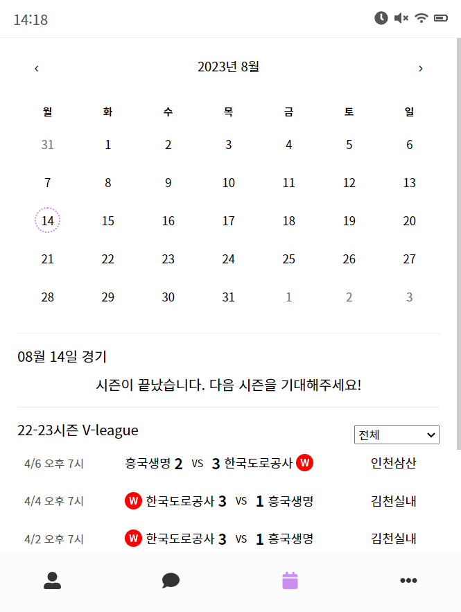

# [React] Bubble 클론 코딩

[](https://wizardly-hermann-7fecb3.netlify.app)

이미지를 클릭하면 사이트로 이동합니다. (읽기전용사이트)

<hr>
<br>

- 파라미터를 이용한 상세페이지를 만드는 것을 연습하기 위해 제작한 프로젝트<br>
- 프로필 화면에 있는 이미지를 클릭하면, 해당 친구의 프로필 이미지를 크게 확인할 수 있음
- 채팅목록을 클릭하면 채팅방으로 이동하며, 친구에게 메세지를 보낼 수 있음 <br>
- <a href="https://my-json-server.typicode.com/" target="_blank">json-server</a>를 이용하여 서버를 가상으로 만들고, 클라이언트 서버에서 get요청을 통해 데이터를 가져옴<br>
  <Br>

---

#### 개발서버 + 클라이언트 서버 오픈하기

`npm run dev`

## #package

### Client

- react 17
- react-router-dom
- react-calendar
- sass

### Server

- json-server
  <Br>

## #route 구성

<br>

<table >
<tr style="text-align:center">
<th width="50%" style="text-align:center">profile</th>
<th width="50%" style="text-align:center">profile detail</th>
</tr>
<tr>
<td style="text-align:center">메인페이지, 내 프로필과 친구들 목록<br/>[구성] 상단바, 페이지 타이틀, 내 프로필, 친구 프로필 목록, NAV</td>
<td style="text-align:center">친구들 프로필 이미지를 클릭하였을 때 출력되는 화면<br/>[구성] 뒤로가기 버튼, 프로필 사진, 이름, 설정 문구</td></tr>
<tr><td></td><td></td><tr>
</table>

<table>
<tr>
<th width="50%" style="text-align:center">chat</th>
<th width="50%" style="text-align:center">chatting</th>
</tr>
<tr>
<td style="text-align:center">채팅방 목록<br/>[구성] 상단바, 페이지 타이틀, 채팅방 목록(프로필사진,이름,마지막 대화 내용),Nav</td>
<td style="text-align:center">채팅방, 친구와 주고받은 메세지를 확인할 수 있음<br/>[구성] 상단바, 친구 이름, 친구가 보낸메세지, 내가 보낸 메세지 목록, 메세지 작성하는 textarea</td></tr>
<tr><td></td><td></td><tr>
</table>

<table>
<tr>
<th width="50%" style="text-align:center">calendar</th>
<th width="50%" style="text-align:center">setting</th>
</tr>
<tr>
<td style="text-align:center">배구 일정을 확인 할 수 있는 달력 페이지<br/>[구성] 상단바, 달력, 오늘 날짜의 경기, 경기 일정(팀별/전체) </td>
<td style="text-align:center">어플 설정 페이지 <br/>[구성] 상단바, 페이지 타이틀, 설정메뉴들(작동X) </td></tr>
<tr><td></td><td></td><tr>
</table>

<table>
<tr>
<th width="50%" style="text-align:center">oversize</th>
<th width="50%" style="text-align:center">loading</th>
</tr>
<tr>
<td style="text-align:center">width가 550px 이상일 경우 나타나는 컴포넌트</td>
<td style="text-align:center">데이터를 받아오기 전까지 나타나는 로딩 컴포넌트 </td></tr>
<tr><td></td><td></td><tr>
</table>

<table>
<tr>
<th width="50%" style="text-align:center">(읽기전용) profile</th>
<th width="50%" style="text-align:center">(읽기전용) chatting</th>
</tr>
<tr>
<td style="text-align:center">배포서버 혹 클라이언트만 오픈했을 때 출력되는 화면<br/>상단바 부분에 읽기전용 UI가 표시됨</td>
<td style="text-align:center">읽기전용일 경우 나타나는 채팅 화면<br/> 메세지 보내기 기능이 제한되기때문에 메세지 입력창에 해당 내용이 안내됨 </td></tr>
<tr><td></td><td></td><tr>
</table>
<br>
<hr>

---

## # useFetch()

[code 보기](./client/src/hooks/useFetch.js)

- 서버에서 데이터 받아오는 hook
- fetchCallback : 개발서버(localhost:3001)에 요청하는 함수
- fetchCallback2 : myjson서버에 요청하는 함수
- [참고 페이지](https://velog.io/@seo__namu/React-%EB%B9%84%EB%8F%99%EA%B8%B0-%EC%B2%98%EB%A6%AC-%EC%83%81%ED%83%9C-%EA%B4%80%EB%A6%AC%ED%95%98%EA%B8%B0)

내용

1. 로딩상태로 변경  
   `dispatch({ type: "LOADING" })`  
   `state: {loading: true, error: null, data: null, readonly: false }`
2. 개발서버에 요청하기  
   `dispatch({ type: "DEV_SERVER_SUCCESS", result: await fetchCallback() })`  
   `state: {loading: false, error: null, data: action.result, readonly: false }`
3. 에러가 발생하면 myjson서버에 요청해 데이터 받아오기  
   `dispatch({ type: "MYJSON_SERVER_SUCCESS",result: await fetchCallback2() })`  
   `state: {loading: false, error: null, data: action.result, readonly: true }`
4. 에러가 발생하면 Error 내용 받기  
   `dispatch({ type: "ERROR", error: error })`  
   `state: {loading: false, error:  action.error, data: null, readonly: false }`

```js
const useFetch = (fetchCallback, fetchCallback2) => {
  const [state, dispatch] = useReducer(
    // 상태 조작함수
    useFetchReducer,
    // 상태 초기값
    {
      loading: false,
      error: null,
      data: null,
      readonly: false,
    }
  );

  const fetchData = async () => {
    dispatch({ type: "LOADING" });

    try {
      dispatch({
        type: "DEV_SERVER_SUCCESS",
        result: await fetchCallback(),
      });
    } catch (err) {
      console.log(err);
      try {
        dispatch({
          type: "MYJSON_SERVER_SUCCESS",
          result: await fetchCallback2(),
        });
      } catch (error) {
        dispatch({ type: "ERROR", error: error });
      }
    }
  };

  useEffect(() => {
    fetchData();
  }, []);

  return {
    ...state,
  };
};
export default useFetch;
```
